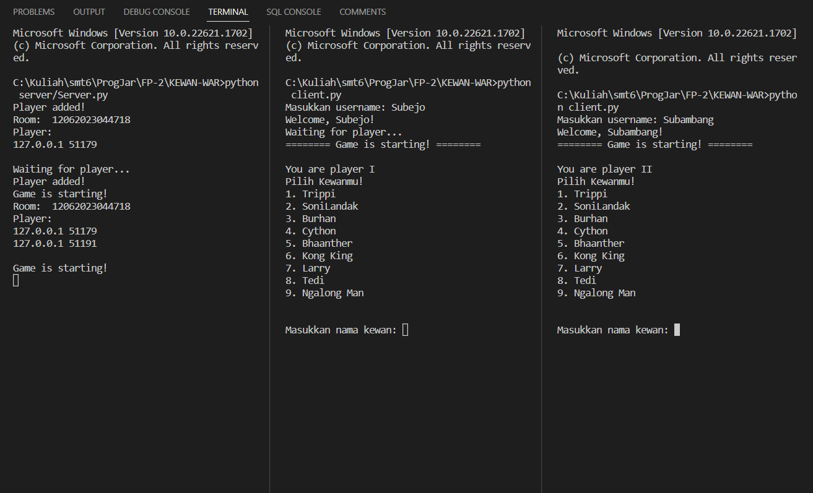
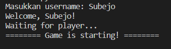
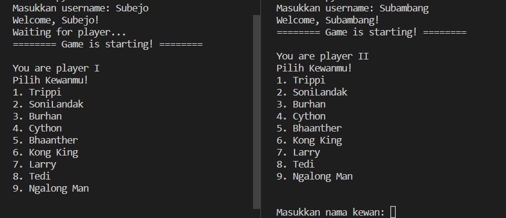
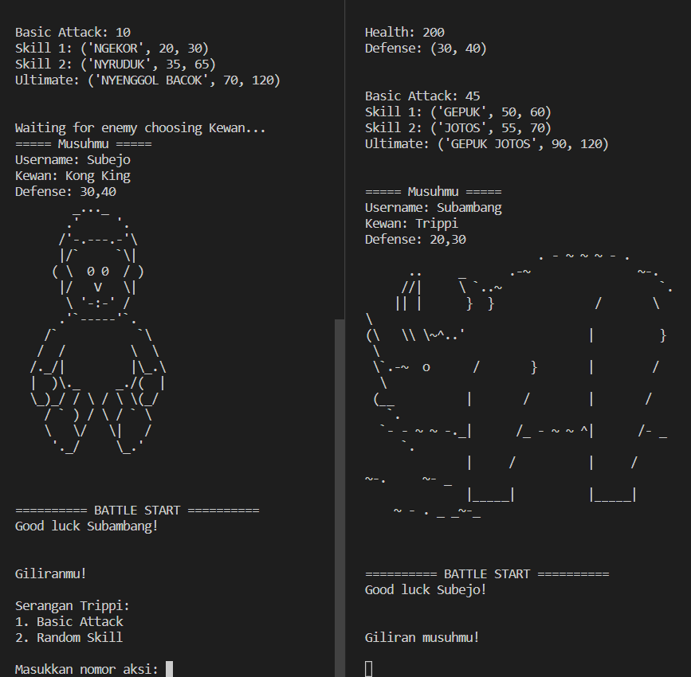
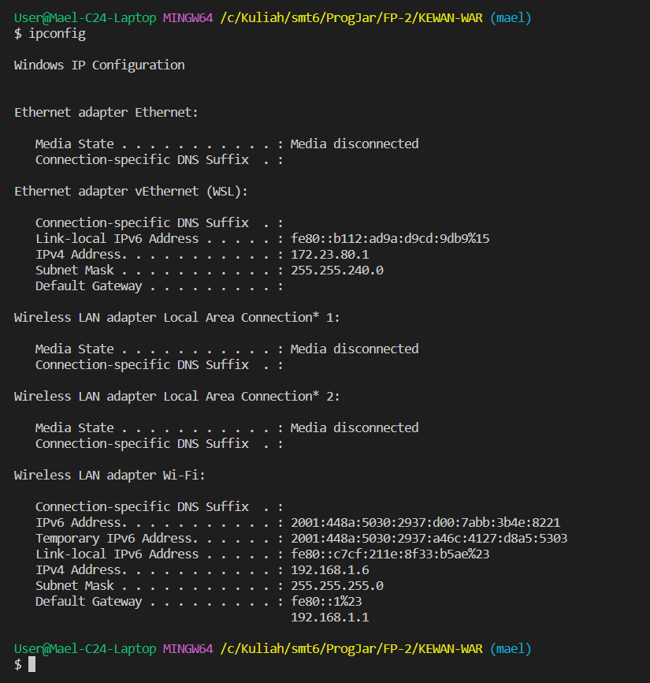

# Final Project Pemrograman Jaringan

## Informasi Game Kewan War 
Judul: Kewan War
Tipe FP: Multiplayer Game
Deskripsi: Kewan War adalah game multiplayer yang dapat dimainkan di terminal oleh banyak player di room berbeda selama player terkoneksi pada jaringan yang sama dengan server.
Player harus memiliki source code [client.py](./client.py).

## Cara Bermain sebagai Player

Untuk bermain sebagai Player, kita bisa menjalankan **server.py** terlebih dahulu. Setelah itu siapkan minimal 2 user atau pemain dan kelipatannya agar dapat bermain di room yang berbeda. Contoh penerapannya seperti berikut.

  

Pada gambar tersebut kita telah membuat 2 user atau player bermain di dalam satu ruangan yang sama, sebelum memilih **Kewan**, player diharuskan untuk menginput username terlebih dahulu seperti gambar berikut.

  

Setelah semua player telah memiliki usernamenya masing-masing, player tersebut dapat memilih kewan yang tersedia. Untuk memilih kewan tersebut, player diharuskan untuk menginput **Nama** dari **Kewan** itu sendiri seperti gambar berikut ini

  

Setiap kewan memiliki kekuatan yang berbeda-beda, di mana terdapat 2 tipe serangan untuk setiap kewan, yaitu **Basic Attack** dan **Random Skill**. Player I akan memperoleh giliran pertama dalam permainan dan Player II akan memperoleh giliran setelahnya. 

  

Selamat Bermain

## Cara Hosting sebagai Server

Untuk Hosting sebagai Server, hubungkan satu laptop ke jaringan internet yang tidak memiliki banyak pengakses, contohnya seperti hotspot hp. 

  

Setelah itu, atur konfigurasi IP pada server melalui **server.conf**, kita bisa mendapatkan IP dengan menggunakan command *ipconfig*.

  

  

Setelah server telah ter set-up, kita siapkan 2 laptop berbeda agar menjadi client atau player pada permainan. Kita harus menyamakan IP pada client sama dengan IP pada server agar dapat bermain di dalam satu room. Setelah semua client terset-up, kita bisa memainkan game tersebut di laptop masing-masing. Selamat Bermain!!

